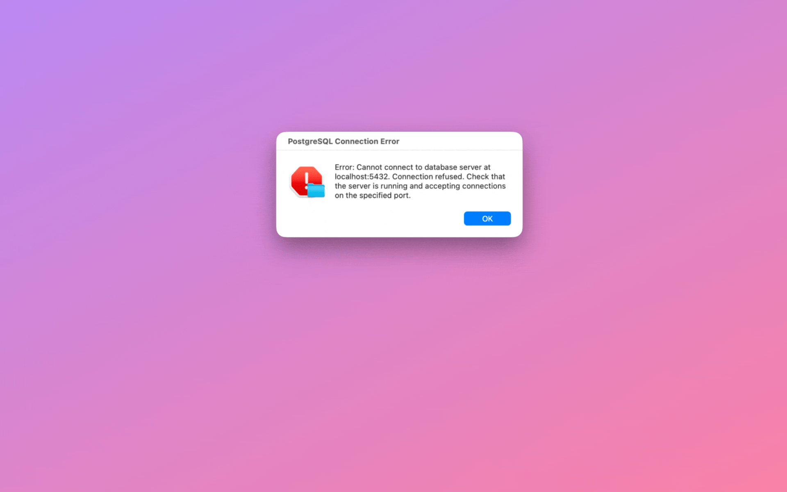

<p align="center">
  
</p>

<h1 align="center">Cai</h1>

<h3 align="center">Act on anything. Locally. </h3>

<p align="center">
  Fire-and-forget actions, built by your agent. Run them anywhere with ⌥C.
</p>

<p align="center">
  <a href="../../releases/latest"></a>
  
  
  <a href="https://huggingface.co/mlx-community"></a>
  

</p>

<p align="center">
  <a href="https://getcai.app">Website</a> · <a href="https://getcai.app/docs/">Docs</a> · <a href="../../releases/latest">Download</a> · <a href="https://github.com/cai-layer/cai-extensions">Extensions</a>
</p>

---

<p align="center">
  
</p>

## What

Select any text or image anywhere, press **⌥C**, and run AI prompts, shell scripts, and connectors like GitHub and Linear. Build the actions yourself, or let Claude Code, Cursor, or Codex write them for you: you approve once, then they run from ⌥C forever, locally, with no agent and no tokens involved. Chain them into pipelines that fire on a single keystroke. **Without the app switching.**

No cloud. No telemetry. No accounts.

## Let your coding agent build your actions

Cai is an [MCP](https://modelcontextprotocol.io) server, so Claude Code, Cursor, Codex, or any MCP-capable agent can author your actions for you. Describe what you want in the agent you already use and it proposes an action. Cai holds the proposal until you approve it, and from then on the action runs from ⌥C on its own, with no agent in the loop. Shell and prompt actions run locally by default.

In Cai, open **Settings → Connections → Agents** and copy the command for your agent. For Claude Code:

```bash
claude mcp add --scope user cai -- ~/Library/Application\ Support/Cai/bin/cai-mcp
```

Your agent gets four tools: `list_actions`, `get_action`, `create_action`, `update_action`. There is no tool that runs an action, deletes one, or approves a proposal, so the most a confused or hostile agent can achieve is a proposal you read and refuse. Cai shows you the whole action before anything is saved, with capability chips computed from the action itself, and flags the parts that deserve a second look: running a shell command, putting your selection into a URL, or pasting over your selection without showing you first. Secrets referenced as `{{secrets.NAME}}` stay in the macOS Keychain; the agent only ever sees the name.

The bridge is a small helper that your agent launches itself and talks to over stdin and stdout. There is no port and no listener, so nothing else on your Mac or your network can reach it.

→ [Agent-authored actions guide](https://getcai.app/docs/usage/agent-actions/)

## How It Works

1. **Select text or copy an image** anywhere on your Mac
2. Press **⌥C** (Option+C)
3. Cai detects the content type and shows relevant actions
4. Pick an action with arrow keys or **⌘1–9**
5. Hit **return** to finish. Result is auto-copied to your clipboard — just **⌘V** to paste

**Examples:**

- Take a screenshot → Create GitHub issue
- Select a recipe → Ask AI: _"Extract ingredients for 2 people"_
- Select `"serendipity"` → Define, Explain, Translate, Search
- Select `"Let's meet Tuesday at 3pm at Starbucks"` → Create calendar event, Open in Maps
- Select an email in Mail → Reply, Summarize, Translate

**Chain example:** Select an article URL → fetch the page → summarize → post to Slack. Four steps. One ⌥C.

→ [Read the full How It Works guide](https://getcai.app/docs/usage/how-it-works/)

## Features

- **Smart content detection** — recognizes what you copied (text, image, URL, JSON, meeting, address) and shows the right actions
- **Built-in AI** — [Apple Intelligence](https://getcai.app/docs/getting-started/llm-setup/) on macOS 26+, or in-process MLX inference on Apple Silicon. No server, no cloud, no setup
- **GitHub & Linear** — create issues from any selected text with AI-generated title, body, and duplicate detection
- **Custom actions** — save reusable AI prompts, URL templates, and shell commands as one-click actions
- **Agent-authored actions** — let Claude Code, Cursor, or Codex write your actions over MCP, approve them once in Cai, run them from ⌥C forever ([see above](#let-your-coding-agent-build-your-actions))
- **Named secrets** — API tokens live in the macOS Keychain, referenced in shell actions as `{{secrets.NAME}}`, never visible to the model or the agent
- **[Action chains](https://getcai.app/docs/usage/action-chains/)** — pipe selection through AI prompts, scripts, and destinations (Slack, GitHub, Apple Shortcuts) in one keystroke. Save the chain once, run it forever.
- **Image to Text** — on-device OCR via Apple Vision framework
- **Bring your own LLM** — works with [LM Studio](https://lmstudio.ai/), [Ollama](https://ollama.com/), any OpenAI-compatible server, or any model from [HuggingFace mlx-community](https://huggingface.co/mlx-community)

Also includes:

- **Custom output destinations** (Mail, Notes, webhooks, AppleScript)
- **Follow-up questions**
- **Context Snippets** (pass per-app context to the LLM)
- **Clipboard history** (last 100, search and pin)
- Keyboard-first (arrow keys, ⌘1–9)
- Community extensions

→ [See all features in the docs](https://getcai.app/docs/)

## Installation

> ⚠️ **One-time manual update needed.** We rotated Cai's update-signing key, so 1.5.1 and older can't auto-update to 1.5.2. Download it from the [latest release](../../releases/latest) or [getcai.app](https://getcai.app) once; auto-updates resume from then on. (A brief "improperly signed" warning is expected and safe.)

### Homebrew

```bash
brew tap cai-layer/cai && brew install --cask cai
```

### Manual Download

1. Download the `.dmg` from the [latest release](../../releases/latest)
2. Open the DMG and drag **Cai.app** to your Applications folder

### After Install

1. Open the app and grant **Accessibility permission** when prompted
2. On macOS 26+, Cai uses Apple Intelligence automatically. Otherwise, the built-in MLX model downloads on first launch — or skip if you already use LM Studio / Ollama

→ [Full installation guide](https://getcai.app/docs/getting-started/installation/) · [LLM setup](https://getcai.app/docs/getting-started/llm-setup/)

### Build from Source

```bash
git clone https://github.com/cai-layer/cai.git
cd cai/Cai
open Cai.xcodeproj
```

In Xcode: select the **Cai** scheme and **My Mac** as destination, then **Product → Run** (⌘R).

> **Note:** The app requires **Accessibility permission** and runs **without App Sandbox** (required for global hotkey and CGEvent posting).

## What's New

→ Check the [full changelog](../../releases/latest)

## Documentation

Full documentation is at [getcai.app/docs](https://getcai.app/docs/):

- **[How It Works](https://getcai.app/docs/usage/how-it-works/)** — content detection, smart actions, Ask AI, follow-ups
- **[Agent-Authored Actions](https://getcai.app/docs/usage/agent-actions/)** — connect Claude Code, Cursor, or Codex; approve; run forever
- **[Custom Actions](https://getcai.app/docs/usage/saved-actions/)** — save prompts, URLs, and shell commands
- **[Action Chains](https://getcai.app/docs/usage/action-chains/)** — one-keystroke, multi-step pipelines
- **[Secrets](https://getcai.app/docs/usage/secrets/)** — Keychain-backed tokens for shell actions
- **[LLM Setup](https://getcai.app/docs/getting-started/llm-setup/)** — Apple Intelligence, MLX, LM Studio, Ollama, cloud providers
- **[Troubleshooting](https://getcai.app/docs/troubleshooting/common-issues/)** — common issues and fixes

## Requirements

- **macOS 14.0** (Sonoma) or later
- **Apple Silicon** (M1 or later) for the built-in AI engine
- **8 GB RAM** minimum, 16 GB recommended for larger models
- **Accessibility permission** (for global hotkey ⌥C)

## Under the Hood

- **SwiftUI + AppKit** — native macOS, no Electron
- **[MLX-Swift](https://github.com/ml-explore/mlx-swift)** — in-process LLM inference on Apple Silicon, no subprocess or server
- **No App Sandbox** — global hotkey requires CGEvent posting outside the sandbox
- **[MCP](https://modelcontextprotocol.io/) both ways, zero external dependencies** — a ~200-line JSON-RPC client for the GitHub and Linear connectors, and a bundled stdio server (`cai-mcp`) that agents talk to for authoring actions

---

## License

[MIT](LICENSE)
